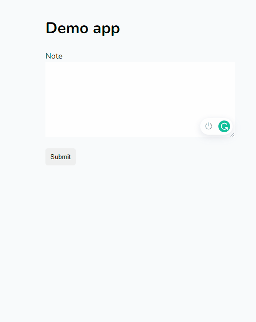

# cloud-run-app

Live link:

<a href="https://laravel-app-kjnzeaw3hq-uc.a.run.app/" target="_blank">https://laravel-app-kjnzeaw3hq-uc.a.run.app/</a>

This app demonstrates how to deploy a Laravel app on Cloud Run using docker and nginx.

To install:

```
composer install
```

```
npm install
```

```
npm run dev
```

Tests:
```
php artisan test
```

Docker build:

```
docker build -t app .
```

Docker deploy:

```
docker run -e PORT=80 -p 80:80 app
```

## Preview:

